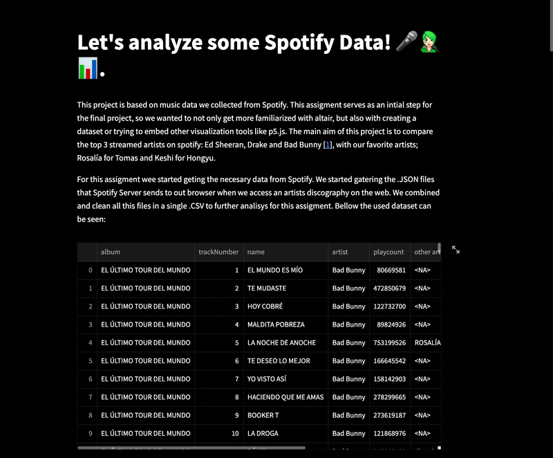

# Project name

## Project Goals

<!-- TODO: **A clear description of the goals of your project.** Describe the question that you are enabling a user to answer. The question should be compelling and the solution should be focused on helping users achieve their goals.  -->

- Which are the most listened artists on spotify? How do you compare their listeners with our personal favorites? Rosalía (for Tomas) and Keshi (for Hongyu). 
- How are the listens among the artist shared? Is the most famous songs that make them the most streamed artists, or are the listeners shared among the discography and not certain songs? 
- Hongyou reasoning

## Design

<!-- TODO: **A rationale for your design decisions.** How did you choose your particular visual encodings and interaction techniques? What alternatives did you consider and how did you arrive at your ultimate choices? -->

-  Our comparision has mainly been count of total song reproductions and total playtime of this songs. We have used filters to give a bigger control on the data we were comparing. Other alternatives would have been comparing focusing on album, or by collaborations, using the other artist data on the songs. For example, Bad Bunny's song 'LA NOCHE DE ANOCHE' is the 36th most played song in the dataset, Rosalia is the second singer of this song. However, Rosalia doesn't make it to the top played songs until position 55th, with her song 'LA FAMA'. Which second artist is The Weekend, who is the 4th more played artist of Spotify. 
- For the theme, we were inspired by the spotify colors. Dark background, white text and bright colors.
- Try to embed javascript and p5js to the sttreamlit app to have more interactive visual content. This is (**Reused code from Previous class Generative systems where I developed the squarify function to generate floor plans)

## Development

<!-- TODO: **An overview of your development process.** Describe how the work was split among the team members. Include a commentary on the development process, including answers to the following questions: Roughly how much time did you spend developing your application (in people-hours)? What aspects took the most time? -->

- [x] Get the data from spotify (json files with the info of each album Spotify queryAlbumTracks&variables, the dowloaded json files are in folder ->'/json_files') -> Tomas (7h) 
- [x] Clean the json files and create the csv file. (Create a python script->'get_data_from_json.py' to read the json files, and get the data we needed into a .csv file ->'spotify_data.csv')-> Tomas (3h)
- [x] Create streamlit app
        . Introductiona and brief data description -> Tomas (2h)
        . Play count filter by artist and albutm and play count sum diplay -> Tomas (3h)
        . _________ -> Hongyu  (______h)
- [x] Html and p5js embeding ->  Tomas (7h) 
        . Try to implement an already squarify function working on p5.js on the streamlit app. This squarify code is based on Squarified Treempas article -> https://link.springer.com/chapter/10.1007/978-3-7091-6783-0_4 
        This function is similar to Squarify library -> https://www.geeksforgeeks.org/treemaps-in-python-using-squarify/

## Success Story

<!-- TODO:  **A success story of your project.** Describe an insight or discovery you gain with your application that relates to the goals of your project. -->

We found out that this kind of interactive explorations with data from Spotify can be a very interesting way to compare artist, trends... However, fot this assigment, the amount of data was limited to the 5 artists we were comparing, this made us want to further develop this app to be able to add more artists.

We discovered that although on the List of most-streamed artists on Spotify the orther of artists is 1.Drake, 2,Bad Bunny, 3.Ed Sheeran. In our dataset, that only takes into account the discography (no singles, or EPs) the actual order top streamed artists is 1.Ed Sheeeran 2.Drake 3.Bad Bunny.On the top 10 stramed songs, 6 are Ed Sheerans, 3 of Drake and only one is Bad Bunnies.

For future work, it would be interesting to include EPs and singles as well as data about the dates it's album was released. This asigment made us wonder if once and artist is famous, is it easier to get more listeners? or are there actually certain albums that contain most of the streams?
