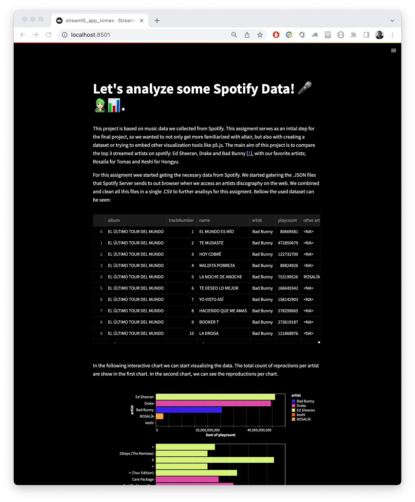

# Project name

TODO: Update screenshot

TODO: Short abstract describing the main goals and how you achieved them.

## Project Goals

<!-- TODO: **A clear description of the goals of your project.** Describe the question that you are enabling a user to answer. The question should be compelling and the solution should be focused on helping users achieve their goals.  -->

- Which are the most listened artists on spotify? how do you compare their listeners with our personal favorites? Rosalía (for Tomas) and ???? (for Hongyu). 
- How are the listens among the artist shared? Is the most famous songs that make them the most streamed artists, or is are listened shared among the songs? 

## Design

<!-- TODO: **A rationale for your design decisions.** How did you choose your particular visual encodings and interaction techniques? What alternatives did you consider and how did you arrive at your ultimate choices? -->

## Development

<!-- TODO: **An overview of your development process.** Describe how the work was split among the team members. Include a commentary on the development process, including answers to the following questions: Roughly how much time did you spend developing your application (in people-hours)? What aspects took the most time? -->

-  [x] Get the data from spotify (json files with the info of each album Spotify queryAlbumTracks&variables) -> Tomas
- [x] Clean the json files and create the csv file. -> Tomas

## Success Story

<!-- TODO:  **A success story of your project.** Describe an insight or discovery you gain with your application that relates to the goals of your project. -->
